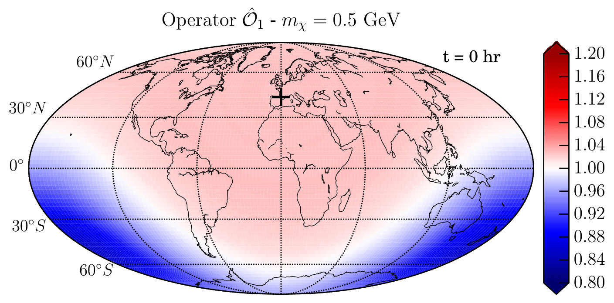
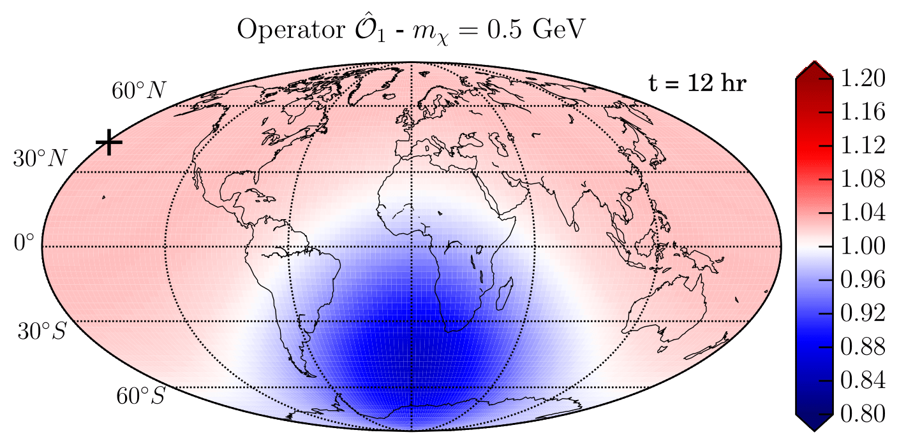

## EarthShadow

**Skip to the good stuff:** Animations showing the daily modulation can be viewed *in browser* on [FigShare](https://dx.doi.org/10.6084/m9.figshare.c.3575630).

The `EarthShadow` code is a tool for calculating the impact of Earth-scattering on the distribution of Dark Matter (DM) particles. The code allows you to calculate the speed and velocity distributions of DM at various positions on the Earth  and also helps with the calculation of the average scattering probabilities. We also include tabulated data for DM-nuclear scattering cross sections and various numerical results, plots and animations. Further details about the physics behind the code can be found in [arXiv:1611.05453](https://arxiv.org/abs/1611.05453).

The code is still being updated, improved and expanded. We will also add more numerical results as they are produced. 

Please contact Bradley Kavanagh ([bradkav@gmail.com](mailto:bradkav@gmail.com?subject=EarthShadow v1.0)) for any questions, problems, bugs and suggestions.

**Version 1.0 Release (17/11/2016):** Initial release.  
**Update (15/12/2016):** Added some results for Operator 5.

### Contents

- `code`: The code folder contains the core of the `EarthShadow` code, in the form of a *Mathematica* package and example notebook.
- `data`: A collection of data tables (Earth element density profiles, DM-nucleus scattering cross sections, etc.) which are read in by `EarthShadow`. 
- `results`: Numerical results for the perturbed speed distributions and scattering probabilities (as a function of DM mass and operator).
- `plots`: Plots and illustrations summarising the key results. Mostly from [arXiv:1611.05453](https://arxiv.org/abs/1611.05453).
- `videos`: Animations showing the time variation of the direct detection rate over the surface of the Earth (and at selected labs).

### Citing EarthShadow

If you make use of the code or the numerical results, please cite:

>Kavanagh, B. J., Catena, R. & Kouvaris, C., 2016, EarthShadow, Astrophysics Source Code Library, record ascl:1611.012

as well as citing the original paper, [arXiv:1611.05453](https://arxiv.org/abs/1611.05453):

>Kavanagh, B. J., Catena, R. & Kouvaris, C. (2016), arXiv:1611.05453.
